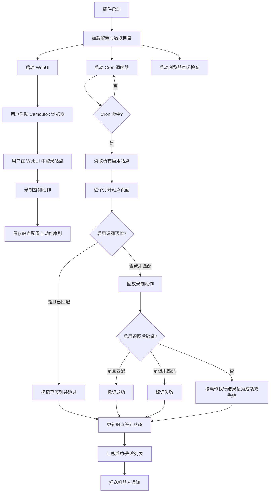

# astrbot_plugin_autocheckin

AstrBot 自动签到插件 —— 通过 Camoufox 浏览器自动化实现多网站每日定时签到。

## 功能

- **WebUI 可视化面板**：内置 VNC 式浏览器控制面板，在网页上直接操作浏览器
- **操作录制与回放**：录制签到所需的点击/输入/拖动/滚动操作，保存后自动回放
- **可视化操作编辑**：逐步查看和编辑录制好的操作，支持修改参数、调整顺序、删除和手动添加步骤
- **定时签到**：支持 Cron 表达式灵活定时，可配置多条计划规则自动执行签到
- **多站点管理**：支持同时管理多个站点，独立启用/禁用
- **识图验证**：可选接入多模态大模型，通过截图 OCR 判断签到是否成功
- **签到预检**：签到前自动识别是否已签到，避免重复操作
- **消息通知**：签到完成后通过机器人会话推送结果
- **登录持久化**：基于持久化浏览器 Profile，重启后无需重新登录
- **空闲自动关闭**：浏览器空闲超时后自动关闭，节省资源

## 插件逻辑

### 核心链路

1. 插件启动后初始化配置、数据目录、WebUI 服务、Cron 调度器和浏览器空闲检查任务。
2. 用户先在 WebUI 中启动 Camoufox 浏览器，通过 VNC 画面手动登录目标站点。
3. 用户为每个站点录制签到动作，动作会以浏览器原生坐标系保存到本地数据文件。
4. 到达定时规则后，调度器遍历所有启用站点，逐个打开页面并回放录制动作。
5. 如果启用了识图验证，系统会先做签到前预检，避免重复签到；签到后再做一次二次验证。
6. 启用识图验证时，签到后二次验证结果会覆盖原始签到结果；匹配关键词记为成功，未匹配记为失败。
7. 执行结果会更新到站点状态中，并通过机器人消息推送到已绑定会话。

### 流程图



## 安装

1. 在 AstrBot 插件市场搜索 `astrbot_plugin_autocheckin` 安装，或手动克隆到插件目录：

```bash
cd <AstrBot数据目录>/addons/plugins/
git clone https://github.com/StarDevProcess/astrbot_plugin_autocheckin.git
```

2. 首次启动时插件会自动下载 Camoufox 浏览器二进制文件。如果自动下载失败，请手动执行：

```bash
pip install camoufox[geoip]
python -m camoufox fetch
```

## 使用方法

### WebUI 操作

1. 插件启动后，访问 `http://<服务器IP>:9010` 打开控制面板
2. 先输入 WebUI 登录密钥（`webui_token`，默认 `sk-change-me`）完成登录验证
3. 点击「启动浏览器」启动 Camoufox 浏览器
4. 在 VNC 画面中操作浏览器，登录目标网站
5. 在左侧面板添加站点
6. 点击「开始录制」，在浏览器中执行签到操作，然后「停止录制」
7. 在「操作编辑」区域检查录制结果，可逐步编辑每个操作的参数、调整步骤顺序或手动增删步骤
8. 将录制的操作保存到对应站点
9. 登录后若切换访问 IP，或长时间无操作导致会话超时，需要重新输入登录密钥
10. 签到流程会在每天设定的时间自动执行

### 操作编辑

在「录制操作」选项卡下方的操作编辑区域，支持：

- **编辑**: 点击铅笔图标修改操作参数
- **排序**: 使用上下箭头调整步骤执行顺序
- **删除**: 移除不需要的步骤
- **添加**: 点击底部「+ 添加操作步骤」手动插入新步骤
- **加载**: 选择站点后点击「加载操作」可将已保存的操作加载到编辑器中进行修改

### 机器人指令

| 指令 | 说明 |
|------|------|
| `/签到 执行` | 立即执行全部站点签到 |
| `/签到 单签 <站点名>` | 签到指定站点 |
| `/签到 状态` | 查看所有站点签到状态 |
| `/签到 绑定` | 绑定当前会话接收签到结果通知 |
| `/签到 解绑` | 解除签到通知绑定 |
| `/签到 面板` | 获取 WebUI 控制面板地址 |

## 配置项

| 配置 | 类型 | 默认值 | 说明 |
|------|------|--------|------|
| `webui_port` | int | 9010 | WebUI 控制面板端口 |
| `webui_token` | string | `sk-change-me` | WebUI 登录密钥，访问控制面板时需要输入 |
| `cron_rules` | text | `30 8 * * *` | 定时签到计划，Cron 表达式，每行一条 |
| `timezone` | string | `Asia/Shanghai` | 定时签到所使用的时区 |
| `headless` | bool | true | 是否以无头模式运行浏览器 |
| `screenshot_interval` | int | 500 | VNC 画面刷新间隔（毫秒） |
| `page_load_timeout` | int | 30 | 页面加载超时（秒） |
| `action_delay` | int | 1000 | 回放操作间隔（毫秒） |
| `checkin_wait` | int | 5 | 打开签到页后、开始回放前的等待时间（秒） |
| `use_vision_check` | bool | false | 是否启用识图验证签到结果 |
| `vision_model_id` | string | "" | 识图使用的多模态大模型 ID |
| `browser_idle_timeout` | int | 10 | 浏览器空闲自动关闭（分钟，0=不关闭） |

### Cron 表达式

格式为标准 5 字段 Cron：`分 时 日 月 周`

```
 ┌─── 分钟 (0-59)
 │ ┌─── 小时 (0-23)
 │ │ ┌─── 日 (1-31)
 │ │ │ ┌─── 月 (1-12)
 │ │ │ │ ┌─── 周几 (0-6, 0=周日)
 │ │ │ │ │
 * * * * *
```

支持语法：`*`（任意值）、`*/n`（步进）、`n-m`（范围）、`n,m`（列表）

示例（多条规则每行一条）：

```
30 8 * * *
0 12 * * 1-5
0 20 1,15 * *
```

| 表达式 | 含义 |
|--------|------|
| `30 8 * * *` | 每天 8:30 |
| `0 9 * * 1-5` | 工作日（周一至周五）9:00 |
| `0 8,20 * * *` | 每天 8:00 和 20:00 |
| `*/30 * * * *` | 每 30 分钟 |
| `0 10 1 * *` | 每月 1 日 10:00 |

## 识图验证

开启 `use_vision_check` 后：

1. 在 WebUI 的「识图选区」选项卡中框选签到结果区域
2. 设置识图关键词（支持正则表达式），如 `签到成功|已签到`
3. 签到前会自动预检：如果关键词已匹配则跳过操作
4. 签到后二次验证：当启用识图验证时，后验证结果覆盖原始签到结果，匹配返回成功，未匹配返回失败
5. 通过 WebUI 执行签到时，识图截图会显示在操作日志中

## 数据存储

插件数据存储在 `<AstrBot数据目录>/plugin_data/astrbot_plugin_autocheckin/`：

- `sites.json` — 站点配置与录制的操作序列
- `notify_targets.json` — 消息通知绑定列表
- `browser_profile/` — 浏览器持久化 Profile（保持登录状态）

兼容说明：如果检测到旧版 `forums.json`，插件会自动读取并迁移到 `sites.json`。

## 依赖

- Python 3.10+
- [camoufox](https://github.com/nichochar/camoufox) — 反指纹浏览器
- [aiohttp](https://github.com/aio-libs/aiohttp) — WebUI 服务器
- [playwright](https://github.com/microsoft/playwright-python) — 浏览器自动化（由 camoufox 内部使用）

## 实现说明

- WebUI 与录制、回放、识图选区全部统一使用浏览器原生坐标系 `1366x768`。
- 浏览器截图与识图裁剪统一使用 CSS 像素尺度，避免 DPI 与随机视口带来的偏移问题。
- 启用识图验证时，签到后验证结果覆盖原始签到结果：匹配返回成功，未匹配返回失败。
- 浏览器空闲自动关闭按真实浏览器操作重新计时，避免“全部签到”执行中途被误关。
- Web 端全部签到、命令签到和定时签到共用同一套签到结果判定逻辑与动作间隔配置。

## 最近更新

- 已修复浏览器空闲超时误判：自动化导航、动作回放、识图截图都会刷新活动时间。
- 已改为识图后验证覆盖原始签到结果：开启识图时，后验证匹配成功，未匹配失败。
- 已统一 Web 全签、命令签到和定时签到的执行链路，避免不同入口行为不一致。

## 许可证

AGPL-3.0 license
